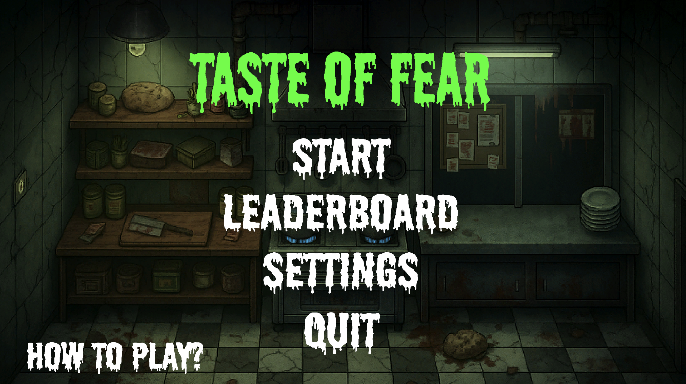
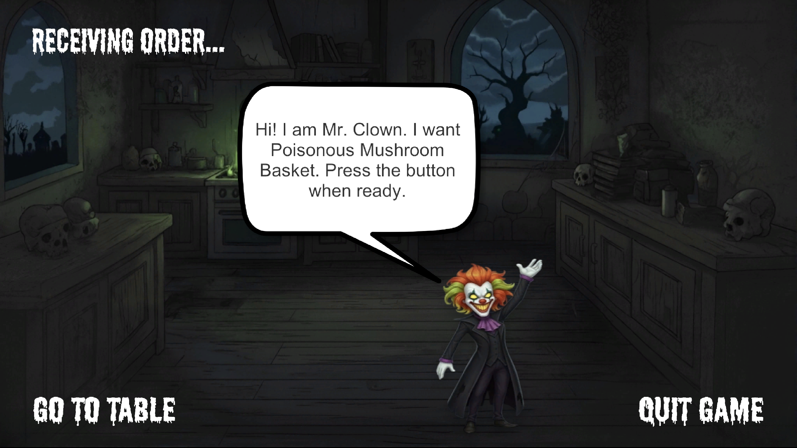
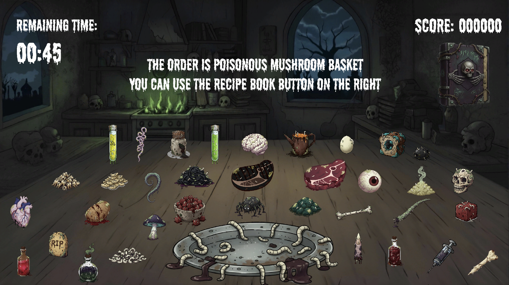

# 🔪 Taste of Fear 👻

**A nightmare-like night in the kitchen. Cook, serve, and survive.**

[-blue.svg)](https://store.steampowered.com/)

---

## 🎬 Game Poster

---

## 🎮 About the Game

**Taste of Fear** is an indie game that mixes **horror** and **time management**. Think about the crazy kitchen action from *Overcooked* mixed with the scary moments from *Five Nights at Freddy's*.

### 📖 The Story

Everything seems normal in a small town. Then suddenly, something goes very wrong. Regular restaurant customers turn into monsters. They want to eat really disgusting food. You are the chef stuck in this nightmare. You must cook what they want before time runs out.

**One mistake. One late order. One second too slow.**  
**That's when the terror begins.**

---

### 🎯 What Makes This Game Special

**⏰ Race Against Time**  
Every second counts as orders pile up and the clock moves toward midnight.

**🍳 Dynamic Kitchen**  
Learn difficult recipes while working in a kitchen full of chaos.

**👻 Real Horror**  
If you fail to deliver on time, scary monsters will jump at you.

---

## ✨ Key Features

- 🏃‍♂️ **Work Fast** - Cook and serve orders before time runs out
- 🍳 **Manage the Kitchen** - Use different cooking stations and make many recipes
- 👻 **Horror Moments** - See scary jumpscares when customers get angry
- 📈 **Hard Difficulty** - Every mistake makes things worse
- 🧟 **Monster Customers** - Normal people turn into creatures that want horrible food
- 👨‍🍳 **High Pressure** - You need speed, skill, and strong nerves to survive the night

---

## 🖼️ Game Screenshots

### Main Menu

### Settings

### Getting Orders

### Playing the Game

---

## 👥 Our Team

| Role | Team Members |
|------|--------------|
| 🎮 **Game Development** | Ali Haktan Sığın • Berat Biçen |
| ✍️ **Story Writing** | Şilan Yalçınkaya • Melisa Demirbaş |
| 🎨 **Art & Design** | Zeynel Zeren • Emin Emre Yalavuç |
| 🔊 **Sound Design** | Yiğit Emre Çay |

---

## 🔧 Technical Details

- **Game Engine:** Unity 2022.3+
- **Programming Language:** C#
- **Screen Size:** 1920×1080
- **Frame Rate:** 60 FPS
- **Platform:** PC (Steam)
- **Development Time:** 9 Weeks
- **Course:** COMP 4460 - Game Programming

---

## 🤖 AI Tools We Used

We used modern AI tools to help us make the game faster and better:

| Tool | What We Used It For |
|------|---------------------|
| 🧠 **Claude Code** | Writing game code and fixing problems |
| 🎨 **Gemini** | Making pictures and art for the game |
| ✨ **Adobe Firefly** | Creating scary jumpscare effects |

---

## 🎓 About This Project

We made this game as a **team project** for our **COMP 4460 GAME PROGRAMMING** class at university. We learned about:

- Mixing different game styles together
- Making scary and dark game environments
- Creating games where time pressure is important
- Working together as a team to make games

---

## 📦 How to Play

**Note:** This game is still being made as a university project.

**What You Need:**
- Computer with Windows 10 or Windows 11
- Screen size: 1920×1080 or bigger
- Unity 2022.3+ (if you want to work on the game)

**How to Start:**
1. Go to our [website](https://taste-of-fear-website.vercel.app/)
2. Download the game
3. Start playing and try to survive!

---

## 🎮 Tips for Playing

- ⚡ **Be Fast** - Learn the recipes so you can cook faster
- 👀 **Watch the Time** - Serve the most angry customers first
- 🎯 **Be Careful** - Working too fast can cause mistakes
- 🧠 **Stay Calm** - When you panic, you make more mistakes

---

## 📄 License

This project was made for our university class. All rights belong to our team.

---

## 🌟 Like Our Game?

**[🌐 Visit Our Website](https://taste-of-fear-website.vercel.app/)**

---

**Development Time:** 9 Weeks | **Engine:** Unity 2022.3+ | **Platform:** Steam

*Made with 💀 and ☕ by the Taste of Fear Team*

**© 2026 | Academic Project**

---

⭐ **If you like our project, please give us a star!** ⭐
