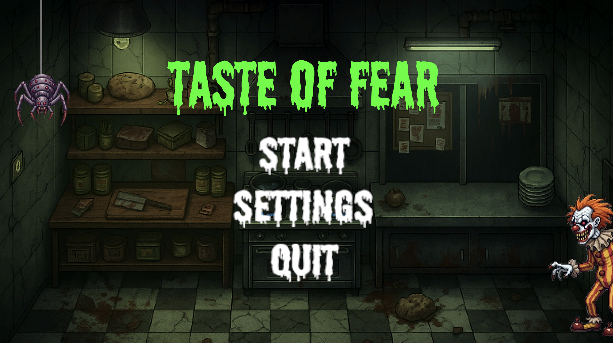
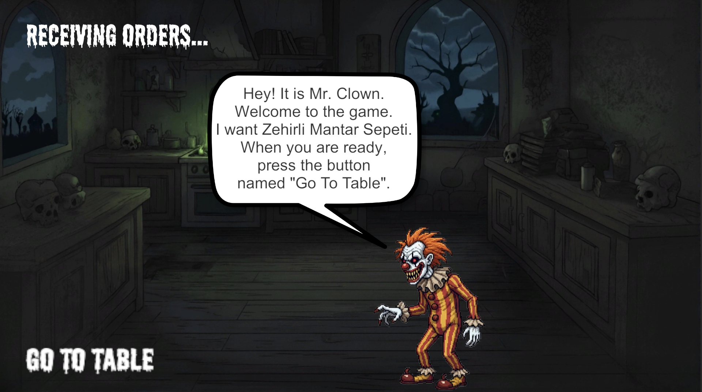
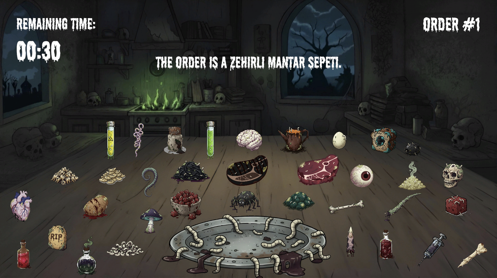

# Taste of Fear 🔪👻
**Mutfakta kabus gibi bir gece. Pişir, sun ve hayatta kal.**

[](https://unity.com/)
[-blue.svg)](https://store.steampowered.com/)

## 🎮 Proje Hakkında
Korku ve zaman yönetimi türlerini harmanlayan bağımsız oyun. Overcooked'un mutfak kaosunu Five Nights at Freddy's korku mekaniğiyle birleştiren bir deneyim.

**Konsept:** 1990'larda lanetli bir restoranda şef Elias Vernon olarak sipariş hazırlarken karanlıktan gelen tehditlerden kaçın.

## 🖼️ Oyundan Görüntüler

### Ana Menü

*Taste of Fear ana menü ekranı - Karanlık mutfak atmosferi*

### Mutfak Sahnesi

*Sipariş alma ve pişirme mekaniği - Tezgahın arkasında korku bekliyor*

### Oynanış

*Zamana karşı yarış - Order #1 siparişini tamamla, hayatta kal*

## ✨ Ana Özellikler
- 🍳 Dinamik mutfak ve sipariş yönetimi
- 🔥 Isı kontrolü ve pişirme sistemi
- 👻 Işık kontrolü, kamera, nefes tutma mekaniği
- 🏃 Kaçış ve hayatta kalma sistemi
- 📈 Her gece artan zorluk

## 🚀 Kurulum
```bash
git clone https://github.com/alihaktan35/taste-of-fear.git
cd taste-of-fear
git lfs install
git lfs pull
```
Unity Hub'dan projeyi açın (Unity 2022.3+)

## 🛠 Geliştirme
### Branch Stratejisi
- `main`: Stabil kod
- `develop`: Aktif geliştirme
- `feature/*`: Yeni özellikler
- `bugfix/*`: Hata düzeltmeleri

### Commit Formatı
```
type(scope): açıklama

feat: yeni özellik
fix: hata düzeltmesi
docs: dokümantasyon
```

## 👥 Ekip
| Rol | İsim |
|-----|------|
| Game Development | Ali Haktan Sığın, Berat Biçen |
| Story & Writing | Şilan Yalçınkaya, Melisa Demirbaş |
| Visual Art | Zeynel Zeren, Emin Emre Yalavuç |
| Audio Design | Yiğit Emre Çay |

## 🔧 Teknik
- **Motor:** Unity
- **Dil:** C#
- **Hedef:** 1920×1080, 60 FPS
- **Platform:** PC (Steam)

## 📅 Takvim
| Aşama | Süre |
|-------|------|
| Pre-Production | 1 Hafta |
| Vertical Slice | 3 Hafta |
| Alpha | 2 Hafta |
| Beta | 2 Hafta |
| Release | 9. Hafta |

## 📄 Dökümanlar
- [Game Design Document](https://docs.google.com/document/d/1qn1N25cj4AN8x7aG0i6QUFiGeOA-1Fah/edit)

---
**Geliştirme Süreci:** 9 Hafta | **Motor:** Unity | **Hedef:** Steam
